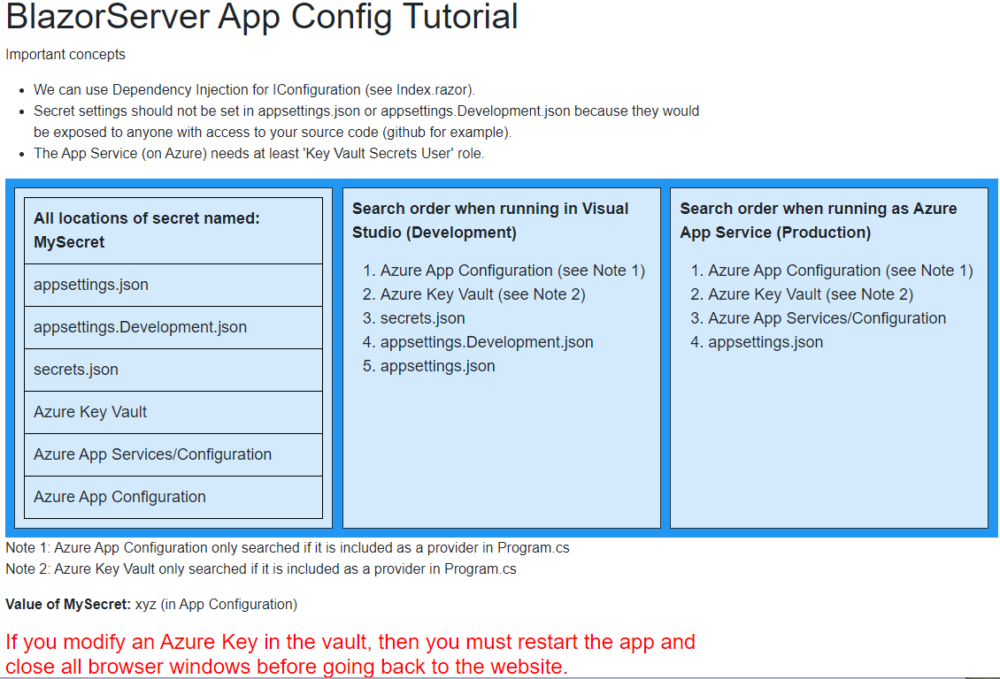

## Design Points
This is the Visual Studio project which is used in a video tutorial for a Blazor Server app showing how to configure 
settings, especially secret settings.  Steps to create and use an Azure key vault are explained.
 

